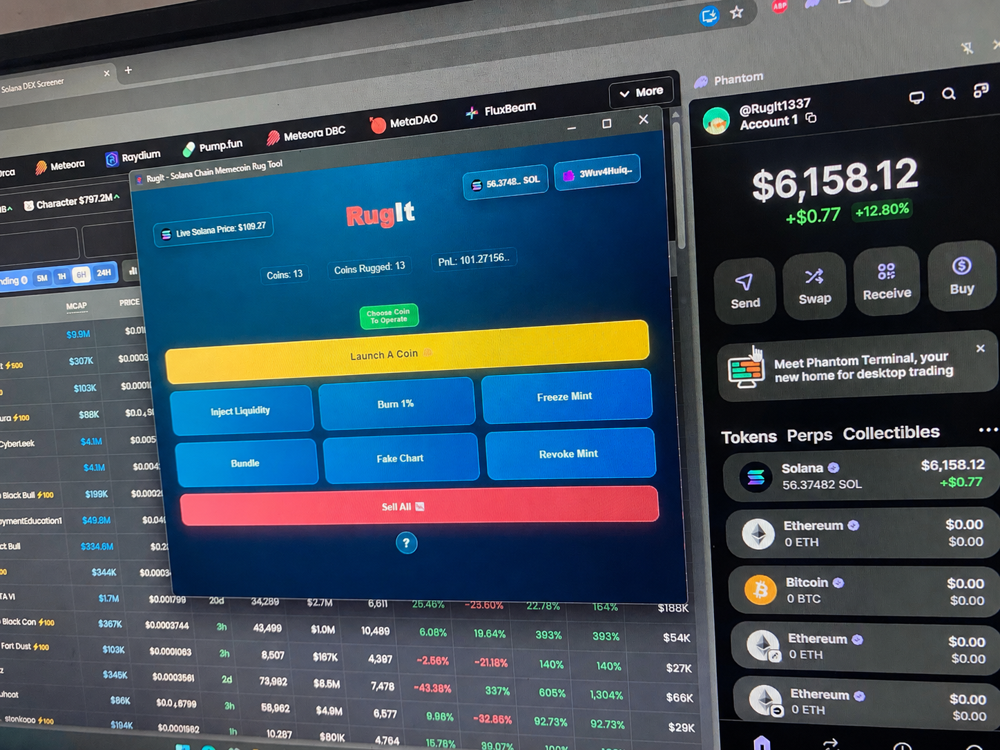
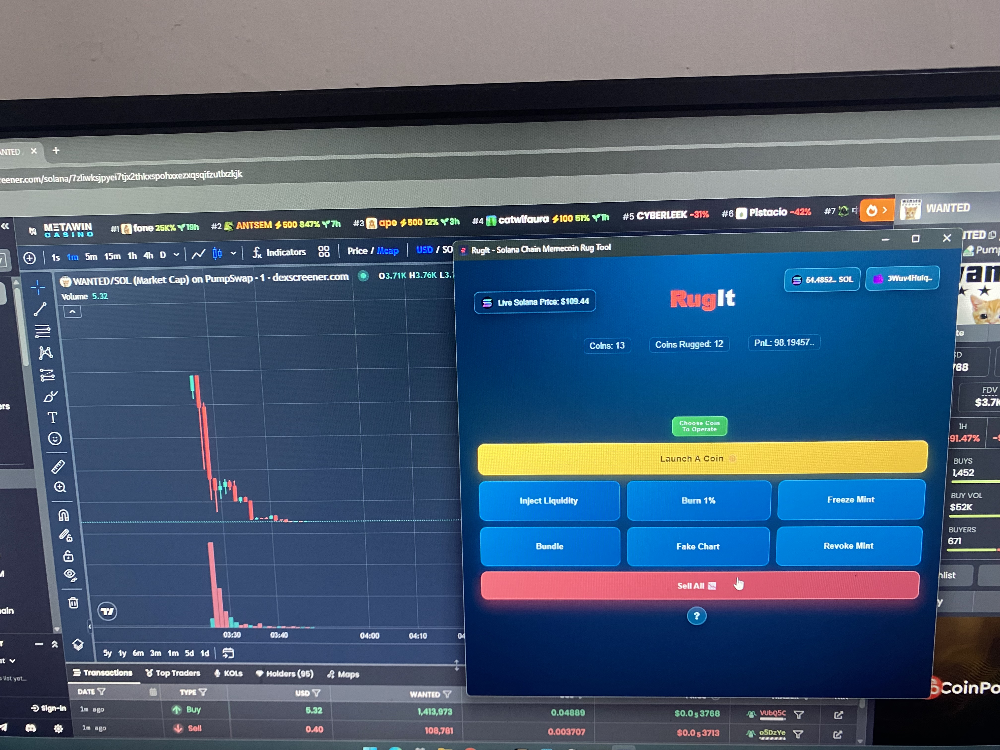
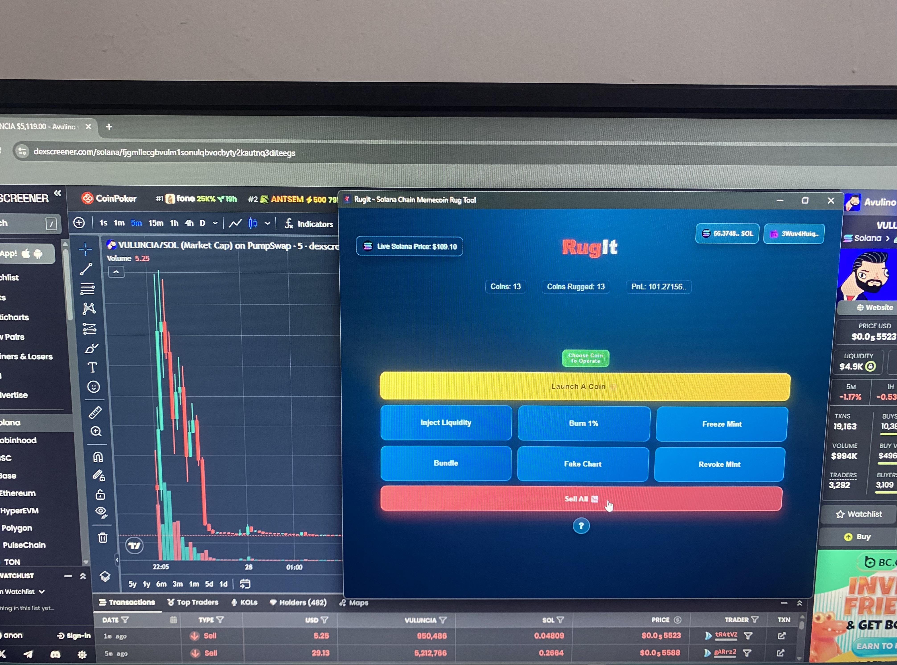

# RugIt

### Solana Memecoin Rug Tool

RugIt is a desktop application built for Solana memecoins Rugpull tools, A complete set ready to use released.

Made For Launching Coins On Pump.fun And Raydium DEX.

Note: it may display a security warning when opening the application since there were some unsigned builds in the progress of applications building.

---

## Download RugIt

### 🪟 Windows

**[Download RugIt for Windows](https://github.com/dreamers1337/Solana-Rug/releases/latest/download/RugIt-Windows.exe)**

Windows installer — `.exe`

### 🍎 macOS

**[Download RugIt for macOS](https://github.com/dreamers1337/Solana-Rug/releases/latest/download/RugIt-MacOS.dmg)**

macOS installer — `.dmg`

### 🐧 Linux

**[Download RugIt for Linux](https://github.com/dreamers1337/Solana-Rug/releases/latest/download/RugIt-Linux.AppImage)**

Linux application — `.AppImage`

**[View all releases](https://github.com/dreamers1337/Solana-Rug/releases)**

---

## Screenshots







---

## About RugIt

RugIt is a desktop tool designed for Solana chain memecoins Rugpull.

---

## Supported Platforms

| Platform | Format      | Architecture |
| -------- | ----------- | ------------ |
| Windows  | `.exe`      | x64          |
| macOS    | `.dmg`      | x64          |
| Linux    | `.AppImage` | x64          |

---

## Installation

### Windows

1. Download `RugIt-Windows.exe`.
2. Run the installer.
3. Follow the installation steps.
4. Launch RugIt from the Start Menu or desktop shortcut.

### macOS

1. Download `RugIt-MacOS.dmg`.
2. Open the downloaded DMG.
3. Install or launch RugIt.

The current macOS build is unsigned, so macOS may display a security warning when opening the application.

### Linux

1. Download `RugIt-Linux.AppImage`.
2. Make it executable:

```bash
chmod +x RugIt-Linux.AppImage
```

3. Run it:

```bash
./RugIt-Linux.AppImage
```

---

## Latest Version

**RugIt v1.6.2**

New versions are automatically published through GitHub Releases.

The download buttons above always point to the **latest release**.

---

## Links

**[Download RugIt](https://github.com/dreamers1337/Solana-Rug/releases/latest)**

**[View Releases](https://github.com/dreamers1337/Solana-Rug/releases)**

---


